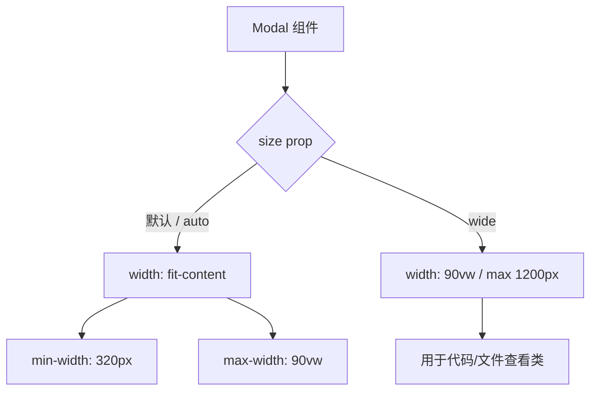

# Dialog 宽度自适应内容重设计方案

## 问题分析

### 当前实现

[`Modal.tsx`](packages/client/src/components/ui/Modal.tsx) 组件的样式定义在 [`modal-components.css`](packages/client/src/styles/renderers/modal-components.css:18) 中：

```css
.modal {
  width: 90vw;        /* 固定占 90% 视口宽度 */
  max-width: 1200px;
}
```

**问题**：所有 dialog 一律使用 `90vw` 宽度，无论内容多少。对于简单的文本对话框（如 Model Switch、Host Offline），这导致大量空白区域，视觉上不紧凑。

### 现有的 workaround

项目已经通过 `:has()` 选择器为两种窄内容做了特殊覆盖：

| 文件 | 选择器 | 覆盖宽度 |
|------|--------|---------|
| [`onboarding.css`](packages/client/src/styles/components/onboarding.css:6) | `.modal:has(.onboarding-wizard)` | `auto`, max `500px` |
| [`host-offline-modal.css`](packages/client/src/styles/components/host-offline-modal.css:6) | `.modal:has(.host-offline-modal-content)` | `auto`, max `480px` |

这种方式不可扩展——每新增一种 dialog 类型都需要写一条 `:has()` 覆盖规则。

### Modal 使用场景分类

| 类别 | 组件 | 内容特征 | 期望宽度 |
|------|------|---------|---------|
| **代码/文件查看** | `ReadRenderer`, `EditRenderer`, `WriteRenderer`, `BashRenderer`, `WriteStdinRenderer`, `FileViewer`, `GitStatusPage` | 代码高亮、diff 展示 | 宽（90vw / max 1200px） |
| **图片/媒体** | `ViewImageRenderer`, `LocalMediaModal`, `UserPromptBlock` 图片预览 | 图片 | 由图片尺寸决定 |
| **工具审批** | `ToolApprovalPanel` | 工具描述 + 操作按钮 | 中等 |
| **进程信息** | `ProcessInfoModal` | 键值对列表 | 窄（~500px） |
| **模型切换** | `ModelSwitchModal` | 列表选择 | 窄（~400px） |
| **文本提示** | `HostOfflineModal`, `SchemaWarning` | 纯文本 + 按钮 | 窄（~480px） |
| **引导向导** | `OnboardingWizard` | 表单步骤 | 窄（~500px） |

---

## 设计方案

### 核心思路：默认 fit-content + size prop



### 1. Modal 组件增加 `size` prop

修改 [`Modal.tsx`](packages/client/src/components/ui/Modal.tsx:5) 的接口：

```tsx
interface ModalProps {
  title: ReactNode;
  children: ReactNode;
  onClose: () => void;
  /** Dialog 尺寸模式
   * - 'auto' (默认): 宽度由内容决定，min 320px，max 90vw
   * - 'wide': 固定宽 dialog，用于代码/文件查看
   */
  size?: 'auto' | 'wide';
}
```

在 `.modal` 元素上添加对应的 CSS 类：

```tsx
<div
  className={`modal${size === 'wide' ? ' modal--wide' : ''}`}
  role="dialog"
  aria-modal="true"
>
```

### 2. 基础 modal CSS 改为 fit-content 模型

修改 [`modal-components.css`](packages/client/src/styles/renderers/modal-components.css:18)：

```css
/* 修改前 */
.modal {
  width: 90vw;
  max-width: 1200px;
}

/* 修改后 */
.modal {
  width: fit-content;
  min-width: 320px;
  max-width: 90vw;
}

.modal--wide {
  width: 90vw;
  max-width: 1200px;
}
```

### 3. 清理现有的 `:has()` 覆盖规则

以下规则可以删除，因为 `fit-content` 默认就会根据内容收缩宽度：

- [`onboarding.css`](packages/client/src/styles/components/onboarding.css:6) 中的 `.modal:has(.onboarding-wizard)` 覆盖
- [`host-offline-modal.css`](packages/client/src/styles/components/host-offline-modal.css:6) 中的 `.modal:has(.host-offline-modal-content)` 覆盖

### 4. 为代码/文件查看类 modal 传入 `size="wide"`

需要给以下组件中的 `<Modal>` 调用添加 `size="wide"`：

| 组件文件 | 说明 |
|---------|------|
| [`ReadRenderer.tsx`](packages/client/src/components/renderers/tools/ReadRenderer.tsx) | 文件内容查看 |
| [`EditRenderer.tsx`](packages/client/src/components/renderers/tools/EditRenderer.tsx) | diff 查看 |
| [`WriteRenderer.tsx`](packages/client/src/components/renderers/tools/WriteRenderer.tsx) | 文件写入查看 |
| [`BashRenderer.tsx`](packages/client/src/components/renderers/tools/BashRenderer.tsx) | 命令输出查看 |
| [`WriteStdinRenderer.tsx`](packages/client/src/components/renderers/tools/WriteStdinRenderer.tsx) | stdin 输入查看 |
| [`FileViewer.tsx`](packages/client/src/components/FileViewer.tsx) | 文件浏览器 |
| [`GitStatusPage.tsx`](packages/client/src/pages/GitStatusPage.tsx) | Git diff 查看 |
| [`ToolApprovalPanel.tsx`](packages/client/src/components/ToolApprovalPanel.tsx) | 工具审批详情预览（含代码/diff） |

### 5. 移动端适配

移动端（`max-width: 767px`）保持现有行为不变——所有 modal 全屏显示：

```css
@media (max-width: 767px) {
  .modal {
    width: 100vw;
    max-width: 100vw;
    /* ... 其余保持不变 */
  }
}
```

---

## 变更文件清单

| 文件 | 变更类型 | 说明 |
|------|---------|------|
| [`Modal.tsx`](packages/client/src/components/ui/Modal.tsx) | 修改 | 添加 `size` prop，传递 CSS 类 |
| [`modal-components.css`](packages/client/src/styles/renderers/modal-components.css) | 修改 | 默认 `fit-content`，新增 `.modal--wide` |
| [`onboarding.css`](packages/client/src/styles/components/onboarding.css) | 修改 | 删除 `:has()` 宽度覆盖 |
| [`host-offline-modal.css`](packages/client/src/styles/components/host-offline-modal.css) | 修改 | 删除 `:has()` 宽度覆盖 |
| [`ReadRenderer.tsx`](packages/client/src/components/renderers/tools/ReadRenderer.tsx) | 修改 | 添加 `size="wide"` |
| [`EditRenderer.tsx`](packages/client/src/components/renderers/tools/EditRenderer.tsx) | 修改 | 添加 `size="wide"` |
| [`WriteRenderer.tsx`](packages/client/src/components/renderers/tools/WriteRenderer.tsx) | 修改 | 添加 `size="wide"` |
| [`BashRenderer.tsx`](packages/client/src/components/renderers/tools/BashRenderer.tsx) | 修改 | 添加 `size="wide"` |
| [`WriteStdinRenderer.tsx`](packages/client/src/components/renderers/tools/WriteStdinRenderer.tsx) | 修改 | 添加 `size="wide"` |
| [`FileViewer.tsx`](packages/client/src/components/FileViewer.tsx) | 修改 | 添加 `size="wide"` |
| [`GitStatusPage.tsx`](packages/client/src/pages/GitStatusPage.tsx) | 修改 | 添加 `size="wide"` |
| [`ToolApprovalPanel.tsx`](packages/client/src/components/ToolApprovalPanel.tsx) | 修改 | 添加 `size="wide"` |

---

## 不需要修改的组件

以下组件使用默认 `size="auto"` 即可，无需改动：

- `ModelSwitchModal` — 列表内容，`fit-content` 自然适配
- `ProcessInfoModal` — 键值对内容，已有 `max-width: 500px` 在内容层
- `HostOfflineModal` — 文本内容，`fit-content` 自然适配
- `SchemaWarning` — 文本内容，`fit-content` 自然适配
- `OnboardingWizard` — 表单内容，`fit-content` 自然适配
- `LocalMediaModal` — 图片内容，`fit-content` 自然适配
- `ViewImageRenderer` — 图片内容，`fit-content` 自然适配
- `UserPromptBlock` 图片预览 — 图片内容，`fit-content` 自然适配
