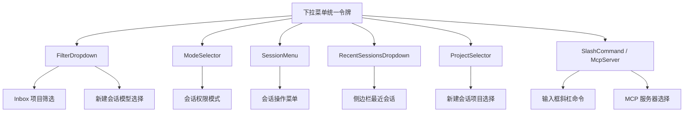

# 下拉菜单样式统一计划

## 1. 现状分析

系统中存在 **6 类下拉菜单组件**，样式参数不一致：

### 现有组件清单

| 组件 | 文件 | CSS 文件 | 使用场景 |
|------|------|----------|----------|
| FilterDropdown | [`FilterDropdown.tsx`](../packages/client/src/components/FilterDropdown.tsx) | [`filter-dropdown.css`](../packages/client/src/styles/components/filter-dropdown.css) | Inbox 项目筛选、新建会话模型选择 |
| ModeSelector | [`ModeSelector.tsx`](../packages/client/src/components/ModeSelector.tsx) | [`session-messages.css`](../packages/client/src/styles/pages/session-messages.css:399) | 会话权限模式选择 |
| SessionMenu | [`SessionMenu.tsx`](../packages/client/src/components/SessionMenu.tsx) | [`session-metadata.css`](../packages/client/src/styles/pages/session-metadata.css:22) | 会话操作菜单 |
| RecentSessionsDropdown | [`RecentSessionsDropdown.tsx`](../packages/client/src/components/RecentSessionsDropdown.tsx) | [`sidebar.css`](../packages/client/src/styles/layouts/sidebar.css:473) | 侧边栏最近会话 |
| ProjectSelector | [`ProjectSelector.tsx`](../packages/client/src/components/ProjectSelector.tsx) | [`project-selector.css`](../packages/client/src/styles/components/project-selector.css) | 新建会话项目选择 |
| SlashCommand / McpServer | [`SlashCommandButton.tsx`](../packages/client/src/components/SlashCommandButton.tsx) | [`file-attachments.css`](../packages/client/src/styles/components/file-attachments.css:240) | 输入框斜杠命令菜单 |

### 样式差异对比

| 属性 | FilterDropdown | ModeSelector | SessionMenu | RecentSessions | ProjectSelector | SlashCommand |
|------|---------------|-------------|-------------|---------------|----------------|-------------|
| **边框** | `--border-subtle` | `--border-subtle` | `--border-default` | `--border-default` | `--border-default` | `--border-default` |
| **圆角** | `--radius-lg` | `--radius-lg` | `--radius-md` | `--radius-md` | `--radius-md` | `--radius-lg` |
| **阴影** | `0 4px 12px rgba(0,0,0,.15)` | `0 4px 12px rgba(0,0,0,.15)` | `0 4px 12px rgba(0,0,0,.3)` | `0 4px 16px rgba(0,0,0,.4)` | `var(--shadow-lg)` | `0 12px 32px rgba(0,0,0,.32)` |
| **选项内边距** | `space-2 space-3` | `space-2 space-3` | `space-2 space-3` | `0.625rem 0.75rem` | `space-2 space-3` | `space-2 space-3` |
| **悬停背景** | `--bg-hover` | `--bg-hover` | `--bg-hover` | `--bg-hover` | `--bg-hover` | `--bg-hover` |
| **选中背景** | `rgba(217,119,87,.08)` | `rgba(217,119,87,.08)` | N/A | N/A | `--bg-active` | N/A |
| **最小高度** | 无 | 无 | `40px` | 无 | 无 | 无 |
| **z-index** | `100` | `100` | `10000` | `10001` | `100` | `100` |

---

## 2. 统一设计规范

### 2.1 统一的设计令牌

在 [`tokens/spacing.css`](../packages/client/src/styles/tokens/spacing.css) 或新建 `tokens/dropdown.css` 中定义：

```css
/* 下拉菜单统一令牌 */
--dropdown-bg: var(--bg-surface);
--dropdown-border: var(--border-default);
--dropdown-radius: var(--radius-lg);
--dropdown-shadow: var(--shadow-lg);
--dropdown-z-index: 10000;

/* 选项 */
--dropdown-option-padding: var(--space-2) var(--space-3);
--dropdown-option-hover: var(--bg-hover);
--dropdown-option-selected: rgba(217, 119, 87, 0.08);
--dropdown-option-min-height: 36px;
--dropdown-option-radius: var(--radius-md);
--dropdown-option-gap: var(--space-2);

/* 文字 */
--dropdown-text-primary: var(--text-primary);
--dropdown-text-muted: var(--text-muted);
--dropdown-text-size: var(--text-sm);

/* 移动端底部弹出 */
--dropdown-sheet-radius: var(--radius-lg) var(--radius-lg) 0 0;
--dropdown-sheet-max-height: 80vh;
--dropdown-sheet-shadow: 0 -4px 20px rgba(0, 0, 0, 0.3);
```

### 2.2 统一规则

| 属性 | 统一值 | 说明 |
|------|--------|------|
| 边框 | `1px solid var(--dropdown-border)` | 使用 `--border-default` 保证可见性 |
| 圆角 | `var(--dropdown-radius)` = `--radius-lg` = `12px` | 更现代的圆角 |
| 阴影 | `var(--dropdown-shadow)` = `--shadow-lg` | 使用设计令牌，适配主题 |
| 选项内边距 | `var(--space-2) var(--space-3)` | 桌面端紧凑，移动端 `var(--space-3) var(--space-4)` |
| 选项悬停 | `var(--bg-hover)` | 已统一 |
| 选项选中 | `var(--dropdown-option-selected)` | 品牌色低透明度背景 |
| 选项最小高度 | `36px` | 保证触摸友好 |
| z-index | `10000` | 统一高层级，确保弹出层在最上方 |
| 动画 | `fadeIn 0.15s ease-out` | 统一淡入动画 |

---

## 3. 实施步骤

### 步骤 1：定义统一 CSS 令牌

**文件**: [`packages/client/src/styles/tokens/spacing.css`](../packages/client/src/styles/tokens/spacing.css)

在 `:root` 中添加下拉菜单相关的设计令牌。

### 步骤 2：重新设计 FilterDropdown（Inbox 页面重点）

**文件**:
- [`packages/client/src/styles/components/filter-dropdown.css`](../packages/client/src/styles/components/filter-dropdown.css)
- [`packages/client/src/components/FilterDropdown.tsx`](../packages/client/src/components/FilterDropdown.tsx)

改动要点：
- **按钮样式**：统一为更清晰的触发器样式，添加 `hover` 时边框变化
- **下拉面板**：使用统一令牌（`--dropdown-*`）
- **选项列表**：统一间距、圆角、选中态
- **移动端底部弹出**：统一 sheet 样式

### 步骤 3：统一 ModeSelector 下拉样式

**文件**: [`packages/client/src/styles/pages/session-messages.css`](../packages/client/src/styles/pages/session-messages.css:399)

改动要点：
- 替换硬编码值为统一令牌
- 统一边框、圆角、阴影
- 保持向上弹出的特殊定位逻辑

### 步骤 4：统一 SessionMenu 下拉样式

**文件**: [`packages/client/src/styles/pages/session-metadata.css`](../packages/client/src/styles/pages/session-metadata.css:22)

改动要点：
- 圆角从 `--radius-md` 改为 `--radius-lg`
- 阴影从硬编码改为 `var(--dropdown-shadow)`
- 选项最小高度统一为 `36px`
- 保持危险操作按钮的红色特殊样式

### 步骤 5：统一 RecentSessionsDropdown 下拉样式

**文件**: [`packages/client/src/styles/layouts/sidebar.css`](../packages/client/src/styles/layouts/sidebar.css:473)

改动要点：
- 圆角从 `--radius-md` 改为 `--radius-lg`
- 阴影从硬编码改为 `var(--dropdown-shadow)`
- 选项内边距统一为设计令牌值

### 步骤 6：统一 ProjectSelector 下拉样式

**文件**: [`packages/client/src/styles/components/project-selector.css`](../packages/client/src/styles/components/project-selector.css)

改动要点：
- 圆角从 `--radius-md` 改为 `--radius-lg`
- 选中态从 `--bg-active` 改为 `var(--dropdown-option-selected)`
- 移动端 sheet 样式统一

### 步骤 7：统一 SlashCommand / McpServer 下拉样式

**文件**: [`packages/client/src/styles/components/file-attachments.css`](../packages/client/src/styles/components/file-attachments.css:240)

改动要点：
- 阴影从硬编码改为 `var(--dropdown-shadow)`
- 其他属性已基本符合规范

---

## 4. 组件架构关系



## 5. 涉及文件清单

| 文件 | 改动类型 |
|------|----------|
| [`tokens/spacing.css`](../packages/client/src/styles/tokens/spacing.css) | 新增令牌 |
| [`components/filter-dropdown.css`](../packages/client/src/styles/components/filter-dropdown.css) | 重构样式 |
| [`pages/session-messages.css`](../packages/client/src/styles/pages/session-messages.css) | 统一样式 |
| [`pages/session-metadata.css`](../packages/client/src/styles/pages/session-metadata.css) | 统一样式 |
| [`layouts/sidebar.css`](../packages/client/src/styles/layouts/sidebar.css) | 统一样式 |
| [`components/project-selector.css`](../packages/client/src/styles/components/project-selector.css) | 统一样式 |
| [`components/file-attachments.css`](../packages/client/src/styles/components/file-attachments.css) | 统一样式 |

---

## 6. 风险评估

- **视觉回归**：改动涉及全局多个组件，需逐页面验证
- **z-index 冲突**：统一为 `10000` 可能与 Modal 层级冲突，需确认现有 Modal z-index
- **移动端适配**：底部弹出 sheet 在不同组件中行为一致，需测试安全区域
