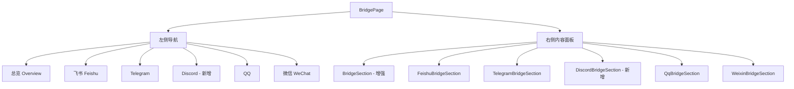
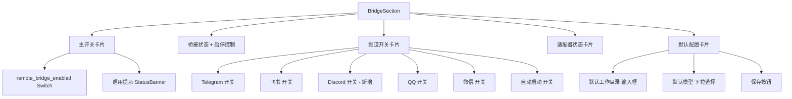

# 远程桥接（Remote Bridge）页面与功能完善计划

## 一、现状对比分析

### 1.1 CodePilot 的远程桥接设计

CodePilot 采用 **独立页面 + 侧边栏导航** 的布局，包含以下组件：

| 组件 | 文件 | 功能 |
|------|------|------|
| [`BridgeLayout.tsx`](../CodePilot/src/components/bridge/BridgeLayout.tsx) | 布局容器 | 左侧导航 + 右侧内容，hash 路由切换 |
| [`BridgeSection.tsx`](../CodePilot/src/components/bridge/BridgeSection.tsx) | 总览页 | 主开关、频道开关、启停控制、适配器状态、默认配置 |
| [`TelegramBridgeSection.tsx`](../CodePilot/src/components/bridge/TelegramBridgeSection.tsx) | Telegram 配置 | Bot Token、Chat ID、允许用户、验证 |
| [`FeishuBridgeSection.tsx`](../CodePilot/src/components/bridge/FeishuBridgeSection.tsx) | 飞书配置 | 应用绑定、凭据、访问策略 |
| [`DiscordBridgeSection.tsx`](../CodePilot/src/components/bridge/DiscordBridgeSection.tsx) | Discord 配置 | Bot Token、频道/服务器策略、验证 |
| [`QqBridgeSection.tsx`](../CodePilot/src/components/bridge/QqBridgeSection.tsx) | QQ 配置 | App ID/Secret、验证 |
| [`WeixinBridgeSection.tsx`](../CodePilot/src/components/bridge/WeixinBridgeSection.tsx) | 微信配置 | 扫码登录、账号绑定 |
| [`useBridgeStatus.ts`](../CodePilot/src/hooks/useBridgeStatus.ts) | Hook | 桥接状态轮询、启停控制 |

**CodePilot BridgeSection 总览页功能特性：**
- ✅ **主开关** `remote_bridge_enabled` — 全局启用/禁用
- ✅ **频道开关** — Telegram/飞书/Discord/QQ/微信 各自独立开关
- ✅ **自动启动** `bridge_auto_start` — 开关
- ✅ **启停控制** — 启动/停止按钮 + 状态显示
- ✅ **适配器状态** — 实时显示各适配器运行状态
- ✅ **默认配置** — 工作目录 + 默认模型选择（支持 Provider 分组下拉）
- ✅ **useBridgeStatus hook** — 独立封装状态轮询逻辑

### 1.2 yepanywhere 现有实现

| 组件 | 文件 | 功能 |
|------|------|------|
| [`BridgePage.tsx`](packages/client/src/pages/BridgePage.tsx) | 页面容器 | 左侧导航 + 右侧内容，hash 路由 |
| [`BridgeSection.tsx`](packages/client/src/components/bridge/BridgeSection.tsx) | 总览页 | 频道状态展示、启停控制、适配器状态 |
| [`TelegramBridgeSection.tsx`](packages/client/src/components/bridge/TelegramBridgeSection.tsx) | Telegram 配置 | 多 Bot 管理、Token/ChatID/Proxy、验证 |
| [`FeishuBridgeSection.tsx`](packages/client/src/components/bridge/FeishuBridgeSection.tsx) | 飞书配置 | 应用绑定、凭据、访问策略 |
| [`QqBridgeSection.tsx`](packages/client/src/components/bridge/QqBridgeSection.tsx) | QQ 配置 | 多 Bot 管理、AppID/Secret、验证 |
| [`WeixinBridgeSection.tsx`](packages/client/src/components/bridge/WeixinBridgeSection.tsx) | 微信配置 | 扫码登录、账号绑定 |

### 1.3 关键差异

| 特性 | CodePilot | yepanywhere | 需要改动 |
|------|-----------|-------------|----------|
| **主开关** | ✅ `remote_bridge_enabled` | ❌ 无 | **新增** |
| **频道独立开关** | ✅ 在总览页可切换 | ❌ 仅展示状态 | **新增** |
| **自动启动开关** | ✅ `bridge_auto_start` | ❌ 无 | **新增** |
| **默认工作目录** | ✅ 输入框 + 浏览按钮 | ❌ 无 | **新增** |
| **默认模型选择** | ✅ Provider 分组下拉 | ❌ 无 | **新增** |
| **Discord 频道** | ✅ 完整组件 | ❌ 无 | **新增** |
| **useBridgeStatus hook** | ✅ 独立 hook | ❌ 内联在组件中 | **提取** |
| **启停控制** | ✅ | ✅ 已有 | 无需改动 |
| **适配器状态** | ✅ | ✅ 已有 | 无需改动 |
| **Telegram 多 Bot** | ❌ 单 Bot | ✅ 多 Bot 管理 | yepanywhere 更优 |
| **飞书快速创建** | ✅ | ✅ 已有 | 无需改动 |
| **QQ 多 Bot** | ❌ 单 Bot | ✅ 多 Bot 管理 | yepanywhere 更优 |

---

## 二、架构设计

### 2.1 组件结构



### 2.2 BridgeSection 增强后的布局



---

## 三、实施步骤

### 步骤 1：提取 `useBridgeStatus` Hook

**目标：** 将 [`BridgeSection.tsx`](packages/client/src/components/bridge/BridgeSection.tsx:32) 中的状态轮询和启停逻辑提取为独立 hook。

**新建文件：** `packages/client/src/hooks/useBridgeStatus.ts`

**提取内容：**
- `status` / `setStatus` 状态
- `refreshStatus` 回调（轮询 `/api/bridge`）
- `starting` / `stopping` 状态
- `handleStart` / `handleStop` 方法
- `pollRef` 轮询定时器逻辑
- 自动 5 秒轮询 effect

**参考：** CodePilot 的 [`useBridgeStatus.ts`](../CodePilot/src/hooks/useBridgeStatus.ts)

**注意：** yepanywhere 的 API 调用需要带 `X-Yep-Anywhere: true` header，与 CodePilot 不同。

### 步骤 2：增强 BridgeSection — 新增主开关

**修改文件：** [`BridgeSection.tsx`](packages/client/src/components/bridge/BridgeSection.tsx)

**新增功能：**
1. 从 `api.getServerSettings()` 获取 `remote_bridge_enabled` 状态
2. 在页面顶部新增主开关卡片（带高亮样式）
3. 主开关关闭时，隐藏其他配置区域
4. 主开关打开时，显示启用提示横幅

**API 对接：** 使用 `api.getServerSettings()` + `api.updateServerSettings()` 读写 `remoteChannels` 配置

### 步骤 3：增强 BridgeSection — 新增频道开关

**修改文件：** [`BridgeSection.tsx`](packages/client/src/components/bridge/BridgeSection.tsx)

**新增功能：**
1. 将现有的频道状态展示改为可交互的开关
2. 每个频道（Telegram/飞书/Discord/QQ/微信）带图标 + 名称 + 描述 + Switch
3. 开关切换直接调用 `api.updateServerSettings()` 保存
4. 新增 `bridge_auto_start` 自动启动开关

### 步骤 4：增强 BridgeSection — 新增默认配置

**修改文件：** [`BridgeSection.tsx`](packages/client/src/components/bridge/BridgeSection.tsx)

**新增功能：**
1. 默认工作目录输入框
2. 默认模型选择（如果 API 支持 Provider 分组则用下拉，否则用文本输入）
3. 保存按钮

### 步骤 5：新增 DiscordBridgeSection

**新建文件：** `packages/client/src/components/bridge/DiscordBridgeSection.tsx`

**功能设计：**
1. 启用/禁用开关
2. Bot Token 输入（密码类型）
3. 验证按钮（调用后端验证接口）
4. 允许用户 ID 输入
5. 允许频道 ID 输入
6. 允许服务器 ID 输入
7. 群聊策略选择（open/disabled）
8. 需要 @提及 开关
9. 流式预览 开关
10. 使用说明

**参考：** CodePilot 的 [`DiscordBridgeSection.tsx`](../CodePilot/src/components/bridge/DiscordBridgeSection.tsx)

**API 对接：** 需要在 `api/client.ts` 中新增 Discord 相关 API 方法（如果后端支持）

### 步骤 6：更新 BridgePage 导航

**修改文件：** [`BridgePage.tsx`](packages/client/src/pages/BridgePage.tsx)

**变更：**
1. 在 `SIDEBAR_ITEMS` 中新增 Discord 项
2. 在 `NavIcon` 组件中新增 Discord 图标（使用 lucide-react 的 `Gamepad2` 图标）
3. 在 `renderSection` 中新增 Discord 路由

### 步骤 7：补充 i18n 翻译键

**修改文件：**
- [`en.json`](packages/client/src/i18n/en.json)
- [`zh-CN.json`](packages/client/src/i18n/zh-CN.json)

**新增键（预估）：**

```json
{
  "bridge.discordSettings": "Discord",
  "bridge.discordChannel": "Discord",
  "bridge.discordChannelDesc": "Bridge notifications to Discord servers and channels",
  "bridge.channels": "Channel Switches",
  "bridge.channelsDesc": "Enable or disable individual bridge channels",
  "bridge.autoStart": "Auto Start",
  "bridge.autoStartDesc": "Automatically start bridge when the server launches",
  "bridge.defaults": "Default Settings",
  "bridge.defaultsDesc": "Default work directory and model for bridge sessions",
  "bridge.defaultWorkDir": "Default Work Directory",
  "bridge.defaultWorkDirHint": "Working directory for bridge-initiated sessions",
  "bridge.defaultModel": "Default Model",
  "bridge.defaultModelHint": "Model used when no specific model is specified",
  "bridge.browse": "Browse",
  "bridge.activeHint": "Bridge is enabled. Configure channels below.",
  "bridge.errorNotEnabled": "Bridge is not enabled. Please enable it first.",
  "bridge.errorNoAdapters": "No adapters could be started.",
  "bridge.errorAdapterConfig": "Adapter configuration is invalid.",
  "discord.credentials": "Bot Credentials",
  "discord.credentialsDesc": "Configure your Discord bot token",
  "discord.botToken": "Bot Token",
  "discord.verify": "Verify",
  "discord.verified": "Bot token verified successfully",
  "discord.verifiedAs": "Verified as {name}",
  "discord.verifyFailed": "Verification failed",
  "discord.enterTokenFirst": "Please enter a bot token first",
  "discord.allowedUsers": "Access Control",
  "discord.allowedUsersDesc": "Restrict which users and channels can use the bot",
  "discord.allowedUserIds": "Allowed User IDs",
  "discord.allowedUsersHint": "Comma-separated Discord user IDs",
  "discord.allowedChannelIds": "Allowed Channel IDs",
  "discord.allowedChannelsHint": "Comma-separated Discord channel IDs",
  "discord.guildSettings": "Server Settings",
  "discord.guildSettingsDesc": "Configure server-level behavior",
  "discord.allowedGuilds": "Allowed Server IDs",
  "discord.allowedGuildsHint": "Comma-separated Discord server IDs",
  "discord.groupPolicy": "Group Policy",
  "discord.groupPolicyOpen": "Open - respond in all servers",
  "discord.groupPolicyDisabled": "Disabled - no group responses",
  "discord.requireMention": "Require @mention",
  "discord.requireMentionDesc": "Only respond when the bot is mentioned",
  "discord.streamPreview": "Stream Preview",
  "discord.streamPreviewDesc": "Show streaming preview in responses",
  "discord.setupGuide": "Setup Guide",
  "discord.setupBotTitle": "Creating a Discord Bot",
  "discord.step1": "Go to Discord Developer Portal",
  "discord.step2": "Create a new application",
  "discord.step3": "Navigate to the Bot section",
  "discord.step4": "Copy the bot token",
  "discord.step5": "Enable Message Content Intent",
  "discord.step6": "Invite the bot to your server",
  "discord.step7": "Paste the token above and verify",
  "discord.setupIdTitle": "Finding IDs",
  "discord.stepDevMode": "Enable Developer Mode in Discord settings",
  "discord.stepUserId": "Right-click a user and copy their ID",
  "discord.stepChannelId": "Right-click a channel and copy its ID",
  "discord.stepGuildId": "Right-click a server and copy its ID"
}
```

### 步骤 8：更新 CSS 样式

**修改文件：** [`bridge.css`](packages/client/src/styles/pages/bridge.css)

**新增样式：**
- `.bridge-channel-switch-row` — 频道开关行（图标 + 名称 + 描述 + Switch）
- `.bridge-channel-divider` — 频道之间的分隔线
- `.bridge-defaults-section` — 默认配置区域
- `.bridge-model-select` — 模型选择下拉框

### 步骤 9：API Client 更新（如需要）

**修改文件：** [`client.ts`](packages/client/src/api/client.ts)

**可能需要新增的 API 方法：**
- Discord 频道的验证/保存接口
- Bridge 设置的统一读写接口（如果后端支持 `/api/bridge/settings`）

---

## 四、文件变更清单

| 操作 | 文件路径 | 说明 |
|------|----------|------|
| **新建** | `packages/client/src/hooks/useBridgeStatus.ts` | 桥接状态 hook |
| **新建** | `packages/client/src/components/bridge/DiscordBridgeSection.tsx` | Discord 配置组件 |
| **修改** | `packages/client/src/components/bridge/BridgeSection.tsx` | 增强总览页 |
| **修改** | `packages/client/src/pages/BridgePage.tsx` | 添加 Discord 导航 |
| **修改** | `packages/client/src/i18n/en.json` | 英文翻译 |
| **修改** | `packages/client/src/i18n/zh-CN.json` | 中文翻译 |
| **修改** | `packages/client/src/styles/pages/bridge.css` | 新增样式 |
| **修改** | `packages/client/src/api/client.ts` | 可能新增 API 方法 |

---

## 五、注意事项

1. **API 兼容性**：yepanywhere 使用 `api.getServerSettings()` / `api.updateServerSettings()` 管理 remoteChannels 配置，而 CodePilot 使用独立的 `/api/bridge/settings` 端点。需要确认后端是否支持 Discord 频道和 bridge 默认配置的存储。

2. **Header 差异**：yepanywhere 的 bridge API 调用需要带 `X-Yep-Anywhere: true` header。

3. **多 Bot 支持**：yepanywhere 的 Telegram/QQ 组件支持多 Bot 管理，这是比 CodePilot 更优的设计，应保留。

4. **Discord 后端支持**：新增 DiscordBridgeSection 前需确认后端是否已实现 Discord adapter。如果后端尚未支持，前端组件可以先创建但标记为实验性功能。

5. **模型选择**：默认模型选择功能依赖 `/api/providers/models` 接口返回 Provider 分组数据。如果该接口不可用，应降级为文本输入框。
